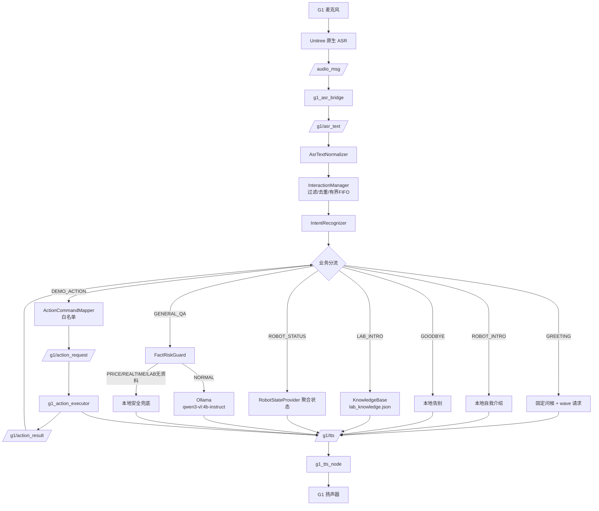
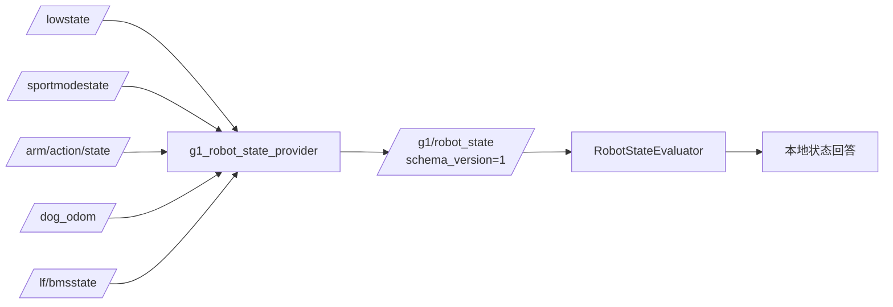
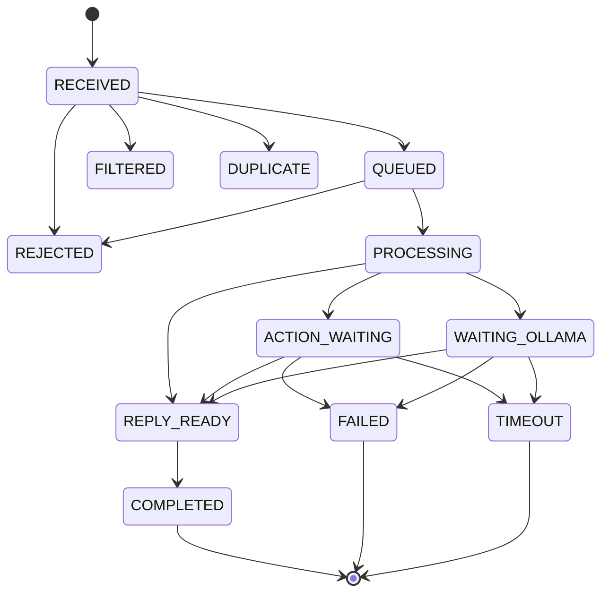
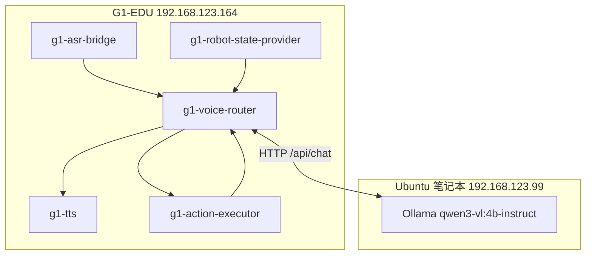

# 架构图（Mermaid）

## 1. 系统总体架构

```mermaid
flowchart TD
    MIC[G1 麦克风] --> ASR[Unitree 原生 ASR]
    ASR --> AM[/audio_msg/]
    AM --> BR[g1_asr_bridge]
    BR --> TXT[/g1/asr_text/]

    TXT --> NRM[AsrTextNormalizer]
    NRM --> IM[InteractionManager<br/>过滤/去重/有界FIFO]
    IM --> IR[IntentRecognizer]
    IR --> RT{业务分流}

    RT -->|GREETING| GR[固定问候 + wave 请求]
    RT -->|ROBOT_INTRO| RI[本地自我介绍]
    RT -->|GOODBYE| GB[本地告别]
    RT -->|LAB_INTRO| KB[KnowledgeBase<br/>lab_knowledge.json]
    RT -->|ROBOT_STATUS| RSP[RobotStateProvider 聚合状态]
    RT -->|GENERAL_QA| FRG[FactRiskGuard]
    RT -->|DEMO_ACTION| ACM[ActionCommandMapper<br/>白名单]

    FRG -->|NORMAL| OLL[Ollama<br/>qwen3-vl:4b-instruct]
    FRG -->|PRICE/REALTIME/LAB无资料| FB[本地安全兜底]

    ACM --> ARQ[/g1/action_request/]
    ARQ --> AE[g1_action_executor]
    AE --> ARS[/g1/action_result/]
    ARS --> RT

    GR --> TTS
    RI --> TTS
    GB --> TTS
    KB --> TTS
    RSP --> TTS
    OLL --> TTS
    FB --> TTS
    AE --> TTS

    TTS[/g1/tts/] --> TTSN[g1_tts_node]
    TTSN --> SPK[G1 扬声器]
```

## 2. 状态数据通路

```mermaid
flowchart LR
    LS[/lowstate/] --> P[g1_robot_state_provider]
    SM[/sportmodestate/] --> P
    AS[/arm/action/state/] --> P
    OD[/dog_odom/] --> P
    BM[/lf/bmsstate/] --> P
    P --> AGG[/g1/robot_state<br/>schema_version=1/]
    AGG --> E[RobotStateEvaluator]
    E --> ANS[本地状态回答]
```

## 3. 交互任务状态机

```mermaid
stateDiagram-v2
    [*] --> RECEIVED
    RECEIVED --> QUEUED
    RECEIVED --> FILTERED
    RECEIVED --> DUPLICATE
    RECEIVED --> REJECTED
    QUEUED --> PROCESSING
    QUEUED --> REJECTED
    PROCESSING --> WAITING_OLLAMA
    PROCESSING --> ACTION_WAITING
    PROCESSING --> REPLY_READY
    ACTION_WAITING --> REPLY_READY
    ACTION_WAITING --> FAILED
    ACTION_WAITING --> TIMEOUT
    WAITING_OLLAMA --> REPLY_READY
    WAITING_OLLAMA --> FAILED
    WAITING_OLLAMA --> TIMEOUT
    REPLY_READY --> COMPLETED
    COMPLETED --> [*]
    FAILED --> [*]
    TIMEOUT --> [*]
```

## 4. 部署拓扑

```mermaid
flowchart TB
    subgraph G1[G1-EDU 192.168.123.164]
        direction TB
        N1[g1-asr-bridge]
        N2[g1-robot-state-provider]
        N3[g1-voice-router]
        N4[g1-tts]
        N5[g1-action-executor]
        N1 --> N3
        N2 --> N3
        N3 --> N4
        N3 --> N5
        N5 --> N3
    end
    subgraph NB[Ubuntu 笔记本 192.168.123.99]
        OL[Ollama qwen3-vl:4b-instruct]
    end
    N3 <-->|HTTP /api/chat| OL
```
